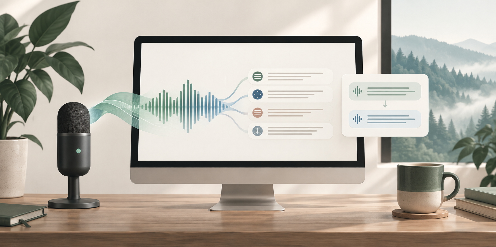

# 声笺 · Local Recorder

> Local-first, real-time speech transcription and translation for Apple Silicon Macs.
> 面向 Apple Silicon Mac 的本地优先实时语音转写与翻译工具。



[](https://www.apple.com/macos/)
[](#requirements--环境要求)
[](LICENSE)

## What it does / 项目简介

**声笺 (Shengjian)** turns microphone, audio-file, or system-audio input into near-real-time text on your Mac. Recognition runs locally with MLX models; the app can also show a floating subtitle window and translate completed sentences with either a local model or an OpenAI-compatible API.

**声笺**可将麦克风、音频文件或系统声音近实时转写为文本。识别使用本机 MLX 模型；应用还支持悬浮字幕窗口，以及通过本地模型或兼容 OpenAI 的 API 对定稿句子进行翻译。

Local transcription does not upload audio. Model downloads, optional AI prompts, and optional API translation require network access; see [Privacy / 隐私](#privacy--隐私) for the exact boundary.

本地转写不会上传音频。模型下载、可选 AI 提问和可选 API 翻译需要联网；准确的数据边界见[隐私](#privacy--隐私)。

## Highlights / 特性

- **Three audio sources** — microphone, audio file (WAV, AIFF, M4A, MP3, and other system-decodable formats), or system audio.
  **三种音源** — 麦克风、音频文件（WAV、AIFF、M4A、MP3 等系统可解码格式）和系统声音。
- **Local, near-real-time transcription** — Qwen3-ASR 1.7B by default; Whisper Large v3 Turbo is also available.
  **本地近实时识别** — 默认 Qwen3-ASR 1.7B，也可切换至 Whisper Large v3 Turbo。
- **Smart endpointing** — reuses previews and conservatively detects sentence endings to reduce duplicate inference and awkward cutoffs.
  **智能定稿** — 复用预览结果并保守判断句末，减少重复推理与生硬断句。
- **Live translation** — local Qwen3/Hunyuan models or saved OpenAI-compatible API profiles, with nine target languages.
  **实时翻译** — 可用本地 Qwen3/Hunyuan 模型或已保存的 OpenAI 兼容 API 服务，并内置九种目标语言。
- **Subtitle and workflow tools** — always-on-top subtitles, text copy/export, menu-bar controls, and configurable shortcuts.
  **字幕与工作流工具** — 置顶字幕、复制与导出文本、菜单栏控制及可配置快捷键。

## Requirements / 环境要求

| Requirement / 要求 | Details / 说明 |
| --- | --- |
| Hardware / 硬件 | Apple Silicon Mac |
| Operating system / 系统 | macOS 14 Sonoma 或更高版本 |
| Build tools / 构建工具 | Xcode Command Line Tools |
| Disk & network / 磁盘与网络 | Model weights are downloaded separately; the default ASR model is about 4.08 GB / 模型权重需另行下载；默认识别模型约 4.08 GB |

> The app is currently locally signed and not notarized, so macOS may require manual approval on first launch.
> 当前应用为本地签名、未公证版本；首次启动时 macOS 可能要求手动允许。

## Quick start / 快速开始

### Build from source / 从源码构建

```bash
git clone https://github.com/IMMIEMIE/Recorder.git
cd Recorder
./scripts/setup.sh
./scripts/build.sh
open "dist/声笺.app"
```

`setup.sh` creates a project-local Python 3.12.14 environment and installs locked dependencies. `build.sh` produces `dist/声笺.app`. To make a DMG as well:

`setup.sh` 会创建项目内的 Python 3.12.14 环境并安装锁定依赖；`build.sh` 生成 `dist/声笺.app`。如需 DMG，可继续运行：

```bash
./scripts/package.sh
```

### First transcription / 第一次转写

1. In **Settings → Transcription**, choose an ASR model and select **Download model**.
   在**设置 → 转写**选择识别模型，再点击**下载模型**。
2. Choose microphone, audio file, or system audio in the main window.
   在主窗口选择麦克风、音频文件或系统声音。
3. Click **Start transcription** and grant the requested macOS permission.
   点击**开始转写**，按提示授予 macOS 权限。
4. Stop to process the final phrase; then copy or export the transcript.
   停止后会处理尾句；随后可复制或导出文本。

The default shortcut is `Control + Option + Space`. Open subtitle mode from the toolbar or menu bar.
默认快捷键为 `Control + Option + Space`；可从工具栏或菜单栏打开字幕模式。

## Models and translation / 模型与翻译

### Speech recognition / 语音识别

| Preset / 预设 | Model ID | Approx. download / 约下载大小 |
| --- | --- | --- |
| Qwen3-ASR 1.7B (default / 默认) | `mlx-community/Qwen3-ASR-1.7B-bf16` | 4.08 GB |
| Whisper Large v3 Turbo | `mlx-community/whisper-large-v3-turbo` | 1.61 GB |

Custom MLX-compatible Qwen3-ASR or Whisper IDs and local model directories are supported. Arbitrary Hugging Face and raw PyTorch/Transformers checkpoints are not directly supported.
支持兼容 MLX 的自定义 Qwen3-ASR / Whisper ID 与本地模型目录；不直接支持任意 Hugging Face 模型或原始 PyTorch/Transformers 权重。

### Live translation / 实时翻译

Translation runs only after a segment is finalized, never on transient preview text. Choose **Local model** or **API service** in **Settings → Translation**.
翻译只处理定稿文本，不会发送识别中的预览文字。在**设置 → 翻译**中选择**本地模型**或 **API 服务**。

| Local preset / 本地预设 | Model ID | Approx. download / 约下载大小 |
| --- | --- | --- |
| Qwen3 4B Instruct (default / 默认) | `mlx-community/Qwen3-4B-Instruct-2507-4bit` | 2.26 GB |
| Hunyuan-MT 7B | `mlx-community/Hunyuan-MT-7B-4bit` | 4.22 GB |

Targets are Simplified Chinese, Traditional Chinese, English, Japanese, Korean, French, German, Spanish, and Russian. API translation sends only finalized text to the saved service; fees are determined by that provider.

目标语言包括简体中文、繁體中文、英语、日语、韩语、法语、德语、西班牙语和俄语。API 翻译仅将定稿文本发送给已保存服务；费用由服务商决定。

## Privacy / 隐私

| Activity / 操作 | Data location / 数据位置 |
| --- | --- |
| Local transcription & translation / 本地转写与翻译 | Runs locally; audio is not uploaded / 在本机运行，不上传音频 |
| Model download / 模型下载 | Downloads selected model weights / 下载所选模型权重 |
| API live translation / API 实时翻译 | Sends finalized text only—not audio or preview text / 仅发送定稿文本，不发送音频或预览文字 |
| AI prompt / AI 提问 | Sends the text in the prompt panel and the requested task / 发送提问面板中的文字及任务 |
| Credentials / 凭据 | API keys are stored in macOS Keychain; profile metadata lives in `~/Library/Application Support/LocalRecorder/` / 密钥保存在 macOS 钥匙串，配置元数据位于上述目录 |

The app does not retain raw recordings or transcript history. System-audio capture uses macOS screen-and-system-audio permission but does not save screen images.
应用不保存原始录音或文字历史。系统声音采集需要 macOS 的屏幕与系统音频录制权限，但不会保存屏幕画面。

## Development / 开发与测试

After `./scripts/setup.sh`, run:

```bash
./scripts/test_ai.sh
.venv/bin/python -m unittest discover -s tests -v
```

Model-dependent verification requires cached weights and Metal access:

```bash
.venv/bin/python scripts/verify_endpoints.py
.venv/bin/python scripts/verify_translation.py
```

Synthetic samples and local test servers are regression checks, not guarantees of recognition quality in every real-world environment. Read [docs/SMART-ENDPOINTS.md](docs/SMART-ENDPOINTS.md) and [docs/VALIDATION.md](docs/VALIDATION.md) for measurements and limitations.

合成样本和本地测试服务适合回归检查，但不代表所有真实环境下的识别质量。测试结果与限制请参阅 [docs/SMART-ENDPOINTS.md](docs/SMART-ENDPOINTS.md) 和 [docs/VALIDATION.md](docs/VALIDATION.md)。

## Contributing / 参与贡献

Issues and pull requests are welcome. Keep changes focused, include tests when practical, and do not commit model weights, virtual environments, or API credentials.
欢迎提交 Issue 和 Pull Request。请保持改动聚焦；尽可能附带测试；不要提交模型权重、虚拟环境或 API 凭据。

## License / 许可证

Licensed under the [Apache License 2.0](LICENSE).
本项目采用 [Apache License 2.0](LICENSE) 开源。
